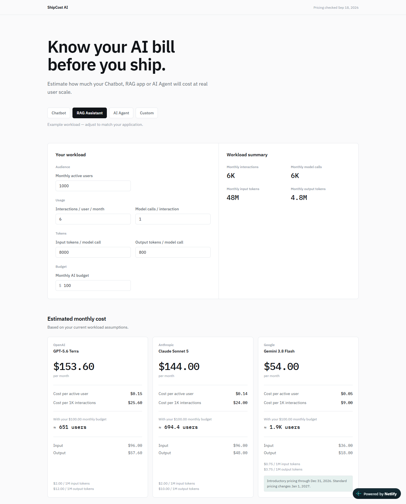

# ShipCost AI

Estimate your AI app cost before you ship.

[Live Demo](https://shipcost-ai.netlify.app/)



ShipCost AI is a lightweight AI API cost planner for developers building chatbots, RAG applications, and AI agents.

Instead of only showing price-per-token tables, ShipCost converts your expected product usage into application-level estimates: monthly cost, cost per user, budget capacity, and scaling cost.

*The preview above shows the RAG Assistant preset at 1,000 users: 6 interactions per user, 1 model call per interaction, 8,000 input and 800 output tokens per call.*

## Why ShipCost AI?

Provider pricing pages tell you what a million tokens costs. They do not tell you what your product will cost, because your bill depends on product decisions instead: how many people use it, how often they interact, and how much context each interaction needs.

ShipCost AI makes those assumptions explicit and editable, then translates them into the numbers you actually plan with:

- What will this cost per month at 1,000 users?
- What does one active user cost us?
- How many users can a $500 monthly budget support?
- What happens to the bill if we grow to 10,000 users?
- Is the bill mostly input tokens or output tokens?

## Features

- Chatbot, RAG Assistant, AI Agent, and Custom workload presets
- Monthly workload estimation (interactions, model calls, input and output tokens)
- OpenAI / Anthropic / Google cost comparison
- Cost per active user
- Cost per 1,000 interactions
- Monthly budget capacity estimation
- Scale simulation from small to larger user bases
- Input vs output cost breakdown
- Official pricing references and verification dates
- Responsive mobile layout
- Keyboard accessible, with labelled inputs and a described chart

## How It Works

1. Pick a preset as a starting point, or enter your own assumptions.
2. Adjust users, interaction frequency, model calls, token sizes, and budget.
3. Every estimate recalculates immediately from your inputs.

All cost figures are produced by two pure functions, `calculateUsage()` and `calculateCost()`, which are the single source of truth for the arithmetic and are covered by unit tests.

## Workload Model

The core abstraction converts product-level usage into token-level spend:

```
Users
  × Interactions per user
  = Monthly interactions

Monthly interactions
  × Model calls per interaction
  = Monthly model calls

Monthly model calls
  × Input tokens per model call
  = Monthly input tokens

Monthly model calls
  × Output tokens per model call
  = Monthly output tokens
```

Then:

```
Monthly input tokens  × provider input price   = input cost
Monthly output tokens × provider output price  = output cost
input cost + output cost                       = estimated monthly cost
```

Derived figures:

```
cost per active user          = monthly cost / users
cost per 1,000 interactions   = monthly cost / monthly interactions × 1,000
budget capacity users         = monthly budget / cost per active user
```

### Why "Model calls per interaction" is separate

Many applications issue more than one model call per user interaction:

- A simple chatbot is usually `1 interaction ≈ 1 model call`.
- A RAG assistant may add a retrieval or reranking step.
- An agent can issue several calls per task: planning, tool use, and a final answer.

Keeping this as its own input lets the same calculator describe all three shapes without special cases.

### Presets are examples, not benchmarks

The Chatbot, RAG Assistant, and AI Agent presets are illustrative starting points chosen to make the tool immediately explorable. They are not industry averages and not measurements of any real system.

Preset values are examples, not industry benchmarks. Users should adjust them to match their own application.

| Preset | Users | Interactions / user | Calls / interaction | Input tokens / call | Output tokens / call |
| --- | ---: | ---: | ---: | ---: | ---: |
| Chatbot | 1,000 | 10 | 1 | 1,500 | 300 |
| RAG Assistant | 1,000 | 6 | 1 | 8,000 | 800 |
| AI Agent | 500 | 4 | 6 | 12,000 | 1,200 |

## Supported Providers

One comparable standard text model per provider:

| Provider | Model |
| --- | --- |
| OpenAI | GPT-5.6 Terra |
| Anthropic | Claude Sonnet 5 |
| Google | Gemini 3.8 Flash |

## Pricing Sources

Prices last verified: **September 18, 2026**

| Provider | Model | Input / 1M | Output / 1M | Source |
| --- | --- | ---: | ---: | --- |
| OpenAI | GPT-5.6 Terra | $2.00 | $12.00 | [Official pricing](https://developers.openai.com/api/docs/models/gpt-5.6-terra) |
| Anthropic | Claude Sonnet 5 | $2.00 | $10.00 | [Official pricing](https://platform.claude.com/docs/en/about-claude/pricing) |
| Google | Gemini 3.8 Flash | $0.75 | $3.75 | [Official pricing](https://ai.google.dev/gemini-api/docs/pricing) |

These values live in [`src/data/pricing.ts`](src/data/pricing.ts), which also carries the verification date and source URL for each model. The application reads them from that file rather than duplicating them in components.

### Gemini 3.8 Flash pricing changes

The listed Gemini 3.8 Flash price is introductory pricing through December 31, 2026.

Google lists standard pricing beginning January 1, 2027 as $1.50 / 1M input tokens and $7.50 / 1M output tokens.

The application displays this notice alongside the Gemini estimate. ShipCost does not switch prices automatically.

## Tech Stack

- React
- TypeScript
- Vite
- Tailwind CSS
- Recharts
- Vitest

## Local Development

```bash
git clone https://github.com/yftx293/shipcost-ai.git
cd shipcost-ai
npm install
npm run dev
```

The dev server prints a local URL (by default `http://localhost:5173`).

No API keys, accounts, or environment variables are required. All pricing is a bundled, manually verified snapshot.

## Testing

```bash
npm test
```

Runs the Vitest suite. The tests cover the calculation core (usage, cost, scale series, cost breakdown), the formatters, and the guards that keep invalid input from producing `NaN` or `Infinity`.

## Build

```bash
npm run build
```

Type-checks the project and produces a production build. The production bundle is generated in `dist/`.

To inspect the production build locally:

```bash
npm run preview
```

`vite preview` is a local static server for checking the built output. It is not a production server.

## Known Limitations

- Pricing is stored as a manually verified snapshot and is not automatically synchronized with provider pricing pages.

- Estimates currently cover standard text token pricing only.

- Prompt caching, batch discounts, tool-specific fees, regional pricing, fine-tuning costs, and other provider-specific pricing rules are not included.

- Token accounting can differ between providers and models. ShipCost does not normalize provider-specific tokenizer behavior.

- Results are estimates based on the workload assumptions entered by the user and should not be treated as an exact invoice forecast.

- ShipCost compares API cost only. It does not compare model quality, latency, reliability, context capabilities, or benchmark performance.

- Gemini 3.8 Flash introductory pricing shown in the application expires on December 31, 2026.

- The scale simulation plots a fixed ladder of user levels (100, 500, 1,000, 2,500, 5,000, 10,000, plus your current scale when it is higher). Points are spaced evenly rather than proportionally, which keeps axis labels readable on narrow screens but means the visual slope is not a linear scale.

- Every cost figure assumes a single provider model repeatedly, with no retries, fallbacks, or multi-model routing.

## Project Structure

```
src/
├── components/
│   ├── calculator/     workload inputs and usage summary
│   ├── comparison/     provider cost cards
│   └── insights/       scale simulator and cost breakdown
├── data/               provider pricing and workload presets
├── lib/                pure calculation and formatting logic
├── types/              domain models
└── App.tsx             state, presets, and composition
```

- `data` — provider pricing and workload presets
- `lib` — pure calculation and formatting logic
- `components` — presentation and interaction
- `types` — domain models

Business logic is deliberately kept out of components: components receive domain objects and call the shared formatters and calculators.
